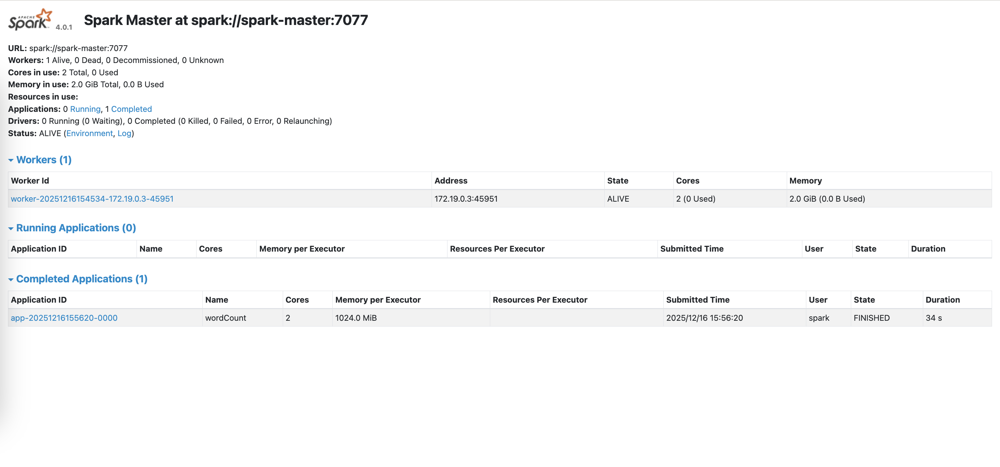
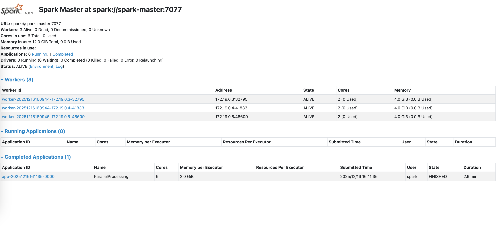

## What You'll Learn

- Setting up a Spark cluster with Docker Compose using official Apache images
- Configuring multi-worker distributed processing
- Mounting volumes for data persistence

## Prerequisites

- Docker Engine installed
- Docker Compose installed
- Basic understanding of Apache Spark concepts
- Familiarity with command line operations

## Single-Node Spark Cluster

```bash
docker compose -f single-node.compose.yml up -d
```

Verify the setup:

```bash
docker ps
```

Open your browser and navigate to: http://localhost:8080
You should see the Spark Master UI showing:

- 1 worker connected
- 2 cores available
- 2GB memory available

Submit a test application:

```bash
docker exec -it spark-master /opt/spark/bin/spark-submit \
  --master spark://spark-master:7077 \
  /opt/spark-apps/word_count.py
```

```bash
+------------+-----+
|word        |count|
+------------+-----+
|Spark       |3    |
|a           |2    |
|Apache      |1    |
|is          |1    |
|analytics   |1    |
|unified     |1    |
|engine      |1    |
|rich        |1    |
|set         |1    |
|provides    |1    |
|in          |1    |
|APIs        |1    |
|Scala,      |1    |
|Java,       |1    |
|R           |1    |
|and         |1    |
|high-level  |1    |
|of          |1    |
|Python      |1    |
|higher-level|1    |
+------------+-----+
only showing top 20 rows
```

<p align="center">
  
</p>

## Multi-Worker Setup for Distributed Processing

```bash
docker compose -f multi-worker.compose.yml up -d
```

Submit a test application:

```bash
docker exec -it spark-master /opt/spark/bin/spark-submit \
  --master spark://spark-master:7077 \
  --executor-memory 2G \
  --total-executor-cores 6 \
  /opt/spark-apps/parallel_processing.py
```

```bash

\nProcessed 100 partitions in 63.15 seconds

+---------+-------------------+---------+
|partition|  avg(random_value)|count(id)|
+---------+-------------------+---------+
|        0| 0.5000658369728165|   100000|
|        1| 0.5001807796927972|   100000|
|        2| 0.5011468260076958|   100000|
|        3|0.49983584574500883|   100000|
|        4|0.49972882429135845|   100000|
|        5| 0.5001239837698693|   100000|
|        6| 0.4995754029505074|   100000|
|        7| 0.5002991392430333|   100000|
|        8| 0.4992573828349517|   100000|
|        9| 0.4991634129537597|   100000|
+---------+-------------------+---------+
only showing top 10 rows

\nNumber of partitions: 12
```

<p align="center">
  
</p>


## Working with Data: File Handling

```bash
docker exec -it spark-master /opt/spark/bin/spark-submit \
  --master spark://spark-master:7077 \
  /opt/spark-apps/sales_analysis.py
```

Check results:

```bash
ls -la spark-data/output/
cat spark-data/output/product_sales/part-*.csv
```

```bash
product,total_quantity,total_revenue
Laptop,8,7999.92
Monitor,10,3999.9
Desk,8,2399.92
Chair,8,1199.92
Keyboard,15,1199
```

```bash
category,transactions,total_items,total_revenue,avg_transaction_value
Electronics,5,53,13799.47,2759.89
Furniture,3,16,3599.84,1199.95
```

## Exercise

Perform analyses on the heart.csv data:

1. What is the most common chest pain type by age group?
2. Explore the effect of diabetes on heart disease.
3. Explore the effect of hypertension on heart disease.
4. Build a machine learning model for heart disease prediction.

Data describe:

- `age` - The age of the patient
- `sex` - The gender of the patient
- `angina` - The chest pain experienced (0: Typical Angina, 1: Atypical Angina, 2: Non-Anginal Pain, 3: Asymptomatic)
- `systolic` - The patient's systolic blood pressure (mm Hg on admission to the hospital)
- `cholesterol` - The patient's cholesterol measurement in mg/dl
- `diabetes` - If the patient has diabetes (0: False, 1: True)
- `electrocardiogram` - Resting electrocardiogram results (0: Normal, 1: ST-T Wave Abnormality, 2: Left Ventricular Hypertrophy)
- `max_heart_rate` - The patient's maximum heart rate achieved
- `exercise_induced_angina` - Exercise induced angina (0: No, 1: Yes)
- `ST_depression` - ST depression induced by exercise relative to rest ('ST' relates to positions on the ECG plot)
- `ST_slope` - The slope of the peak exercise ST segment (0: Upsloping, 1: Flatsloping, 2: Downsloping)
- `number_of_major_vessels` - The number of major vessels (0-3)
- `thalassemia` - A blood disorder called thalassemia (0: Normal, 1: Fixed Defect, 2: Reversible Defect)
- `heart_disease` - Heart disease (0: No, 1: Yes)